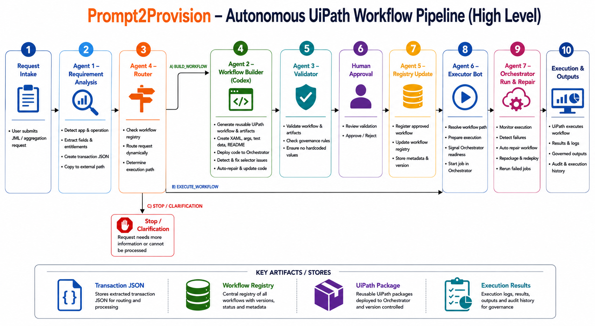

# Prompt2Provision UiPath Execution Layer

## Introduction

Prompt2Provision is an autonomous UiPath execution layer for disconnected application lifecycle management. It supports joiner, mover, and leaver provisioning requests as well as aggregation-style operations for applications that do not have direct API or connector coverage. It reads a plain-language lifecycle request, converts it into a structured queue transaction, routes it to an approved reusable UiPath workflow, and executes the workflow through the `Prompt2ProvisionUiPath` process.

The current workspace includes the BroadRiver demo application. BroadRiver supports disconnected application lifecycle operations such as `create_user`, `modify_user`, and `delete_user`, and the same framework can be extended to account, entitlement, and access aggregation use cases. Request-specific data is passed through queue JSON and workflow arguments, so workflows remain reusable and do not hardcode user values.

Demo videos are available here:

```text
https://drive.google.com/drive/folders/1B60PxIdps5i3CE0bhh7WmNC7m4eBTNV4?usp=sharing
```

## Architecture Diagram



## Solution Details

The solution is designed for disconnected apps where identity lifecycle work must be performed through a UI, exported files, or other non-API surfaces. It has two main parts:

- Python pipeline agents in `agents/`
- A UiPath project in `uipath_project/`

The pipeline flow is:

1. `agents/agent1_requirement_analysis.py` reads the incoming identity-platform request. In this local workspace, `data/jml_request.txt` is used as the request input. The agent detects the application and operation from `app_profiles`, validates required fields, resolves entitlement metadata when applicable, and writes the queue transaction.
2. `agents/agent4_router.py` checks `registry/workflow_registry.json` to decide whether an approved workflow already exists.
3. If an approved workflow exists, the pipeline executes it through UiPath.
4. If a workflow does not exist, the pipeline prepares a builder prompt and validation flow for creating one.
5. `agents/agent3_validator.py` validates generated workflow artifacts, checks for hardcoded runtime values, runs `uip rpa get-errors`, and builds the UiPath project.
6. `agents/agent5_registry_update.py` registers approved workflows for future reuse.

`uipath_project/Main.xaml` is the generic UiPath router. It reads the `Prompt2Provision_QueueDataPath` Orchestrator Text asset, loads the queue transaction JSON from that file path, extracts `application_id`, `operation`, `base_url`, `fields`, and optional `entitlement_details`, then invokes the matching child workflow.

Workflow selection is dynamic:

- `create_user` -> `CreateUser.xaml`
- `modify_user` -> `ModifyUser.xaml`
- `delete_user` -> `DeleteUser.xaml`

BroadRiver assets are stored here:

- Application profile: `app_profiles/broadriver.json`
- UI map: `app_profiles/broadriver_ui_map.json`
- Workflows: `uipath_project/workflows/apps/broadriver/`
- Approved workflow registry: `registry/workflow_registry.json`

Queue transaction outputs are written to:

- `queues/pending_queue_item.json`
- `outputs/automation_contract.json`
- `C:\Prompt2ProvisionData\pending_queue_item.json`

The UiPath process reads the external queue path from the Orchestrator Text asset named `Prompt2Provision_QueueDataPath`.

## Prerequisites

Install and configure these before running:

- Python 3
- UiPath Studio or Robot on the machine that will run the automation
- UiPath CLI available as `uip`
- UiPath Orchestrator access
- A configured Orchestrator folder, currently expected to be `Development`
- The BroadRiver demo application running and reachable at the `base_url` in `app_profiles/broadriver.json`

The current BroadRiver profile uses:

```text
http://localhost:4000/
```

## One-Time Setup

1. Sign in to UiPath CLI.

   ```powershell
   uip login
   ```

2. Create or update the Orchestrator Text asset.

   Asset name:

   ```text
   Prompt2Provision_QueueDataPath
   ```

   Asset value:

   ```text
   C:\Prompt2ProvisionData\pending_queue_item.json
   ```

3. Confirm the `Development` Orchestrator folder has a runtime template that can run the process.

4. Confirm the stable package/process name in Orchestrator is:

   ```text
   Prompt2ProvisionUiPath
   ```

## How to Run

1. Provide the incoming identity request.

   In production, this request comes from the identity platform or integration layer. In this local workspace, `data/jml_request.txt` is the stand-in input file for the disconnected app lifecycle request. This can be a JML provisioning request or an aggregation-related request. The request should include the application name, operation, and all required fields for that operation.

   Example fields for BroadRiver `create_user` provisioning:

   ```text
   Application: BroadRiver
   Operation: create user
   User Name: Jane Smith
   Employee ID: E12345
   Email: jane.smith@example.com
   Department: Finance
   Region: North America
   User Type: Employee
   Requested Group: AP_VIEWER
   Manager Email: manager@example.com
   Duration: Permanent
   ```

2. Run the autonomous pipeline from the repository root.

   ```powershell
   py -3 run_autonomous_pipeline.py
   ```

3. Review generated outputs.

   The main files to check are:

   - `outputs/automation_contract.json`
   - `queues/pending_queue_item.json`
   - `outputs/routing_decision.json`
   - `outputs/execution_result.json`
   - `outputs/execution_test_result.json`

4. If the router finds an approved workflow, the pipeline executes the workflow.

   The registry entry must exist in `registry/workflow_registry.json` and have `status` set to `approved`.

   For aggregation scenarios, the approved workflow should write its extracted account, entitlement, or assignment data to the agreed output artifact for downstream identity processing.

5. If the router returns `BUILD_WORKFLOW`, let the pipeline continue the new-workflow path.

   The pipeline writes the builder prompt to `prompts/agent2_codex_builder_prompt.txt`, drives workflow creation, validates generated artifacts, updates the registry after approval, packages/deploys the UiPath project, and executes the process.

## Run the UiPath Project Directly

Use this path when you only want to run the existing UiPath package/process with the latest queue JSON.

1. Ensure `C:\Prompt2ProvisionData\pending_queue_item.json` exists.
2. Ensure the Orchestrator asset `Prompt2Provision_QueueDataPath` points to that file.
3. Run the `Prompt2ProvisionUiPath` process from UiPath Assistant or Orchestrator.
4. Check the process output and logs in Orchestrator.

## How to Onboard New Application

In a real deployment, the lifecycle or aggregation request comes from the identity platform. The pipeline receives that request data, creates the queue transaction, routes it, and performs the required build/validation/execution flow. Operators should not manually create queue JSON or run each downstream step one by one.

1. Add the application profile once at `app_profiles/<application_id>.json`.

   Include `application_id`, `application_name`, optional `aliases`, `base_url`, supported `operations`, operation detection `phrases`, `required_fields`, and any `entitlements`. Use `app_profiles/broadriver.json` as the reference shape.

2. Add the UI map once at `app_profiles/<application_id>_ui_map.json`.

   Define each operation's `workflow_name`, ordered business steps, and success validation text. Do not store selectors in this file. Selectors must be captured from the live browser or desktop application during workflow creation and stored in the generated XAML/Object Repository artifacts.

3. Configure the identity platform to send lifecycle or aggregation requests into the pipeline input.

   In this local challenge workspace, `data/jml_request.txt` represents that incoming identity-platform request. In production, the same request would come from the identity platform or integration layer rather than being typed manually into the file.

   The request must contain the application name or alias, an operation phrase, and all required fields from the application profile. For aggregation use cases, fields may describe the aggregation scope, source screen/report, output format, or target dataset instead of user provisioning attributes.

4. Run the pipeline from the repository root.

   ```powershell
   py -3 run_autonomous_pipeline.py
   ```

5. Let the pipeline handle the remaining steps.

   The pipeline analyzes the incoming request, creates the queue transaction, checks the approved workflow registry, executes an existing reusable workflow when one is available, or starts the new-workflow build path when the operation has not been automated yet.

   For a new operation, the pipeline is responsible for producing the builder prompt, validating generated artifacts, approving/registering the workflow after review, packaging/deploying the UiPath project, and executing the process through the stable `Prompt2ProvisionUiPath` process in the `Development` Orchestrator folder.

After onboarding, future identity-platform requests for the same `<application_id>.<operation>` route automatically to the approved reusable workflow.
